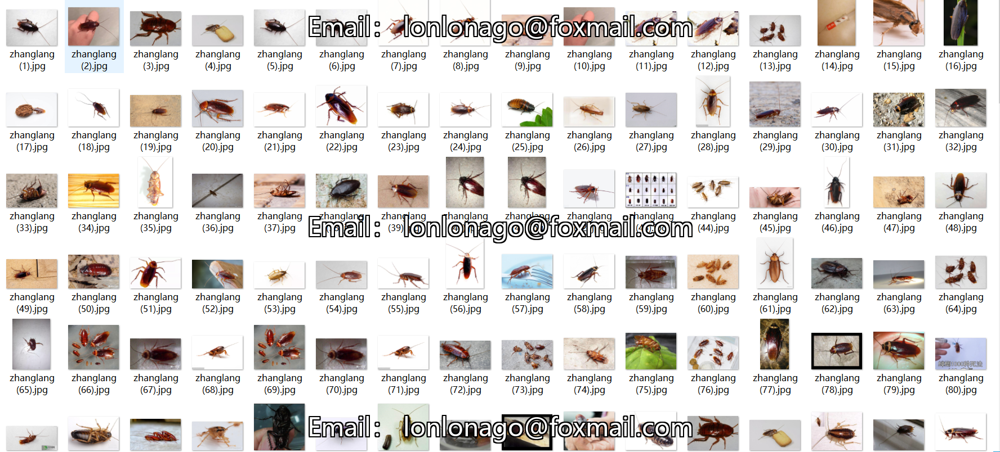
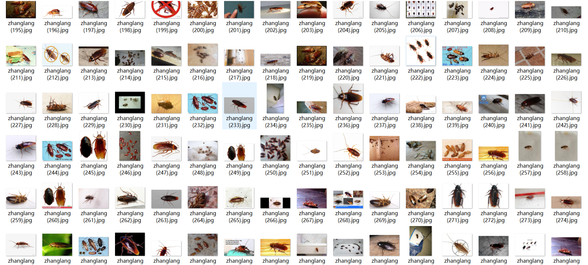

# [Object Detection] Cockroach Detection Dataset 370 imagesVOC+YOLO format

Dataset Description: ~

Dataset format: Pascal VOC format + YOLO format (the txt file does not contain the split path, it only contains jpg images and corresponding VOC format xml files and yolo format txt files)

Number of images (number of jpg files): 374

Number of annotations (number of xml files): 374

Number of annotations (number of txt files): 374

Number of categories: 1

Annotation class names: ["cockroach"]

Number of boxes labeled in each category:

cockroach frame count = 943

Total boxes: 943

Use the labeling tool: labelImg

Rules for annotation: Draw a rectangle around the category.

Other Notes: Image crawling from Baidu web pages, manual labelImg annotation, verified the accuracy of the annotation, can buy with confidence.

## Images

---

Here is a pay link on Stripe (https://buy.stripe.com/3cs8yP7sY87d0vu9AB). Please contact me lonlonago@foxmail.com after funding $89, and I will send you a complete data files, thank you!

